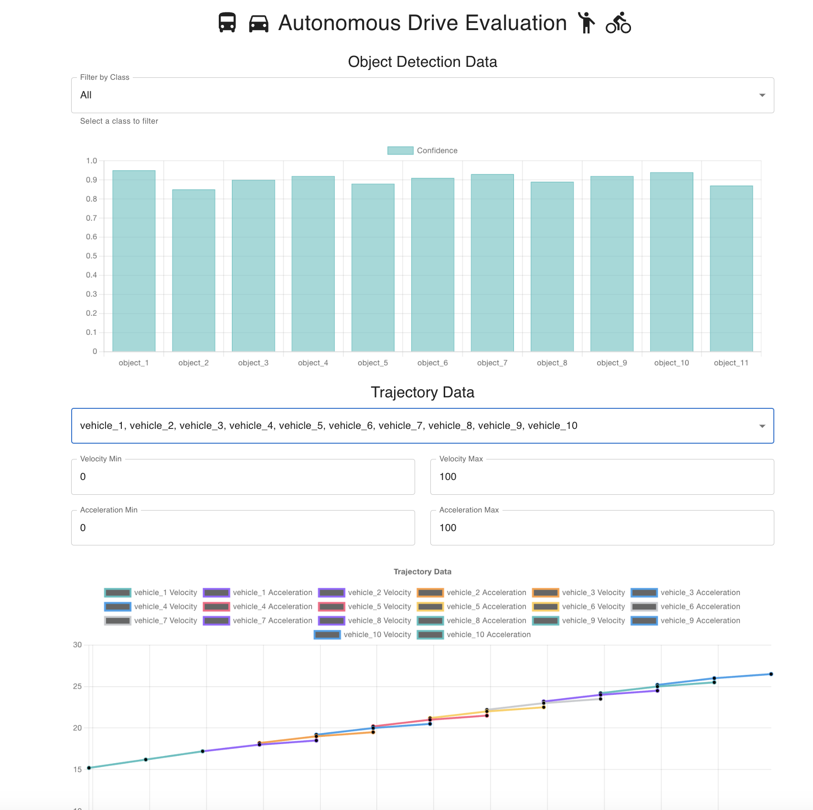

# Autonomous Drive Evaluation

## Overview

This is a tool for evaluating the performance of autonomous driving models. It includes functionalities for object detection and trajectory analysis, and is designed to support model evaluation and selection processes. The project is built with a Flask backend and a React frontend, ensuring scalability and a responsive user interface.

## Features

- **Object Detection Data**: Visualize object detection data with filter options for different object classes such as cars, pedestrians, and cyclists.
- **Trajectory Analysis**: Analyze and visualize the trajectory data of different vehicles, including velocity and acceleration over time.
- **Filtering and Selection**: Filter object detection data by class and select specific vehicles for detailed trajectory analysis.
- **Interactive Charts**: Use interactive charts to visualize and explore the data in an intuitive manner.

## Screenshot




## Technologies and Libraries Used

### Backend

- **Flask**: A micro web framework written in Python.
- **Flask-Cors**: A Flask extension for handling Cross-Origin Resource Sharing (CORS), making cross-origin AJAX possible.

### Frontend

- **React**: A JavaScript library for building user interfaces.
- **TypeScript**: A typed superset of JavaScript that compiles to plain JavaScript.
- **Material-UI**: A popular React UI framework that implements Google's Material Design.
- **Axios**: A promise-based HTTP client for the browser and Node.js.
- **Chart.js**: A JavaScript library for creating charts.

## Setup Instructions

### Clone the Repository

1. Clone the repository to your local machine:

    ```sh
    git clone https://github.com/YOUR_GITHUB_USERNAME/autonomous-drive-eval.git
    cd autonomous-drive-eval
    ```

### Backend Setup

1. Navigate to the backend directory:

    ```sh
    cd backend
    ```

2. Create a virtual environment:

    ```sh
    python -m venv myenv
    ```

3. Activate the virtual environment:

    - On Windows:
        ```sh
        myenv\Scripts\activate
        ```
    - On macOS/Linux:
        ```sh
        source myenv/bin/activate
        ```

4. Install the dependencies:

    ```sh
    pip install -r requirements.txt
    ```

5. Run the Flask server:

    ```sh
    flask run
    ```

### Frontend Setup

1. Navigate to the frontend directory:

    ```sh
    cd ../frontend
    ```

2. Install the dependencies:

    ```sh
    npm install
    ```

3. Start the development server:

    ```sh
    npm start
    ```

## Usage

1. Ensure both the backend and frontend servers are running.
2. Open your browser and navigate to `http://localhost:3000` to access the frontend application.
3. Use the filter options to select object classes and vehicles for analysis.
4. Interact with the charts to visualize object detection and trajectory data.

## Future Enhancements

- **Integration with Real-time Data**: Enhance the system to support real-time data streaming and analysis.
- **Advanced Analytics**: Incorporate advanced analytics features like anomaly detection and predictive modeling.
- **User Management**: Implement user authentication and role-based access control for better security.

---

*Developed by Heming Liu, 2024*